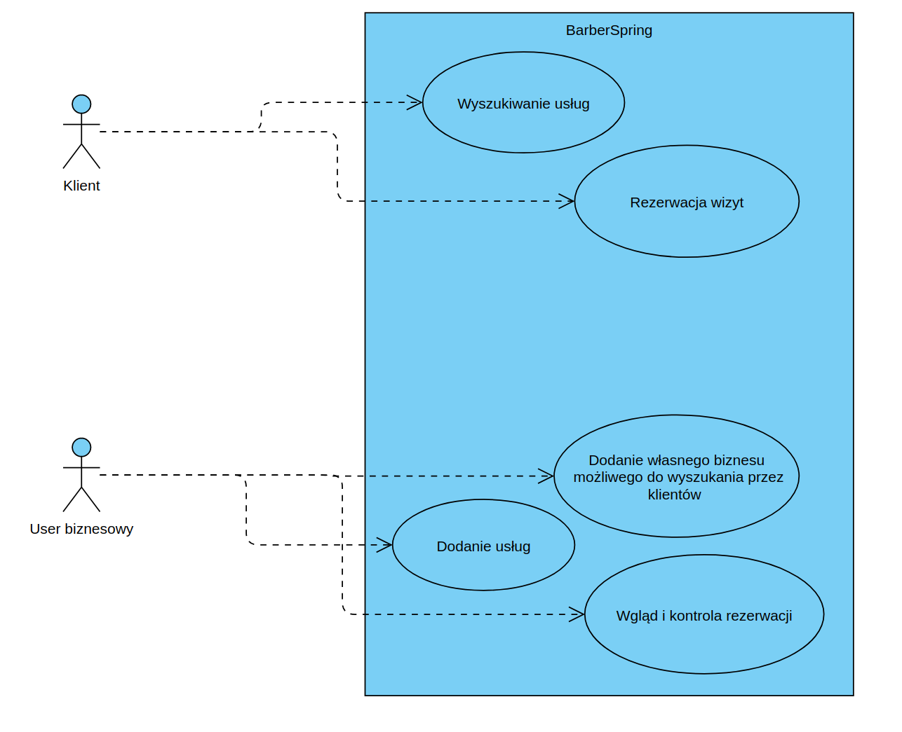
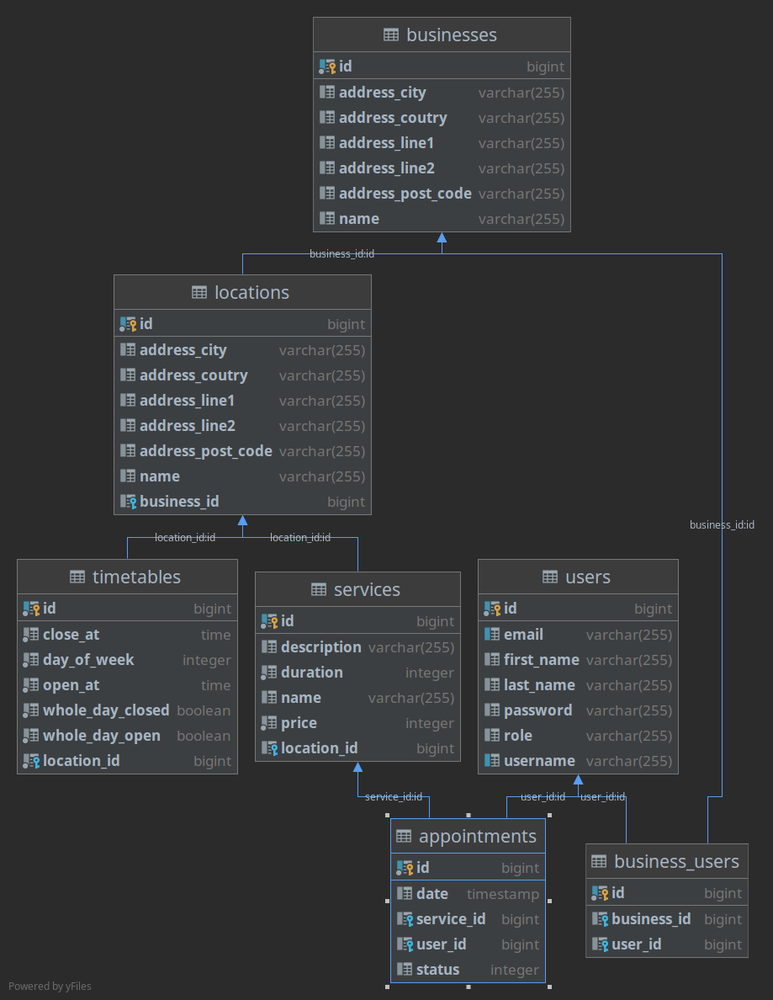

# BarberSpring #

## Opis ##

Projekt _BarberSpring_ to aplikacja do rezerwowania wizyt na usługi w różnych salonach (np. na strzyżenie w salonie fryzjerskim).

Isnieją dwa rodzaje użytkowników: użytkownicy i użytkownicy biznesowi.
Zwykli użytkownicy (klienci) mogą przeglądać listę dostępnych salonów oraz usług przez nie oferowanych 
a następnie umówić wizytę w wybranym dostępnym terminie.
Użytkownicy biznesowi mogą natomiast stworzyć swój biznes i zarządzać należącymi do niego salonami i usługami. 
Mają także wgląd w umówione przez klientów spotkania i możliwość ich anulowania.

## Struktura bazy danych ##

W katalogu `docs` dostępny jest [skrypt SQL](./docs/barber_example_data.sql) wypełniający bazę przykładowymi danymi.

Przykładowe konta:
* Użytkownik biznesowy: `mkolodziej`
* Użytkownik (klient): `gkalinowski`

Wszystkie konta utworzone przy pomocy tego skryptu mają hasło `password`.

## Wymagania ##

1. Java 11
2. docker
3. docker-compose

## Uruchamianie ##

### Baza dancyh ###
1. `cd src/main/java/com/spring/barber/docker/`
2. `docker-compose up`
   
### Backend ###
3. Przed pierwszym uruchomieniem ustawić `spring.jpa.hibernate.ddl-auto=create` w pliku `application.properties`.
4. W folderze głównym projektu: `mvn spring-boot:run`
5. Lista dostępnych API udostępniona jest w przeglądarce:
    * Narzędzie Swagger: http://localhost:8080/api/swagger-ui/
